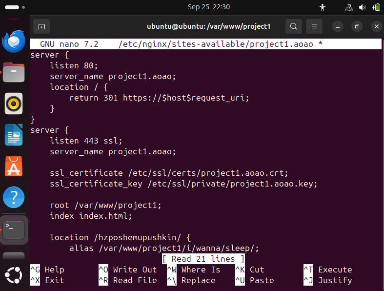
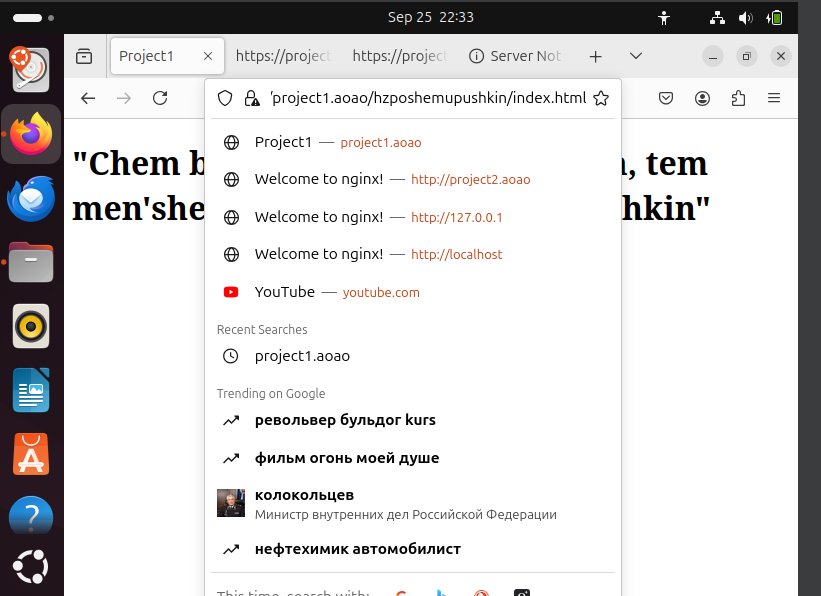

# Первая лабораторная работа

## Что от нас хотят?

В ходе лабораторной работы необходимо, чтобы:

* Подключение осуществлялось через протокол https с сертификатом;
* Было настроено принудительное перенаправление HTTP-запросов (порт 80) на HTTPS (порт 443) для обеспечения безопасного соединения;
* Использовался alias для создания псевдонимов путей к файлам или каталогам на сервере;
* Имелись настроенные виртуальные хосты для обслуживания нескольких доменных имен на одном сервере.

### Приступим!

## Установка nginx

~~Работать будем на WSL, ведь мы не ищем легких путей и вообще зачем все эти ваши линуксы, если можно без линуксов)~~

Ох, как же я ошибался. Убил на исправление ошибок с портами часа 2 безуспешно, все равно `localhost` выдает только то, что лежит на 80 порту винды, а не ubuntu. Не тратьте время на это, лучше установить виртуалку и не знать бед.

Установив виртуалку с Ubuntu, запускаем команду, устанавливающую nginx: 


И о чудо, при вводе в строку браузера `localhost` у нас выводится приветственная страница nginx:


Значит это, что у нас есть собственный веб-сервер, но он пустой. Ура ура почти вся лаба готова! ~~ага конечно~~

## Создание проектов
В рамках данной лабораторной работы будем поднимать сервер с двумя сайтами. Для них создадим две папки
```bash
sudo mkdir -p /var/www/project1
sudo mkdir -p /var/www/project2
```

В этих папках создадим два сайта с простым содержанием


Прекрасно, файлики нужные есть. Теперь необходимо прописать этим файликами домены, чтобы можно было их тестировать локально.

Для этого заходим в консоль и прописываем команду
```bash
sudo nano /etc/hosts
```
И мы попадаем в встроенный редактор кода nano, в котором нужно установить нужные локальные домены. Установим `project1.aoao` и `project2.aoao`.

Чтобы сохранить, жмем `Ctrl + O`, сохраняем файл и выходим из nano, нажав `Ctrl + X`


Теперь домены у проектов есть, но файлы конфигурации не настроены. Надо исправлять.

## Настройка файлов конфигурации
Но прежде всего подумаем о перенаправлении с порта 80 на порт 443(безопасное подключение).

### Создание самоподписанных ssl сертификатов
Мы люди не гордые и делать все по умному(через специальные центры сертификации и тд) не будем, просто сгенерируем самоподписанный ssl сертификат.

Генерируем все это дело на 365 дней и сохраняем по указанным путям.


Сертификаты есть, переходим к настройке файлов конфигурации

### Собственно настройка файлов конфигурации

В файлах конфигурации у нас будет два блока `server{}`, где в одном у нас запросы буду слушаться на порту 80(http) и перенаправляться на https, а во втором блоке запросы будут уже слушаться на порту 443(https). В каждом блоке нужно имя сервера `server_name`, которое будет такое же, как и наши указанные локальные домены(так мы указываем, для какого домена серверу надо обрабатывать запросы). Во втором блоке будут указываться наши самоподписанные сертификаты  `ssl_sertificate` и ключи `ssl_sertificate_key`. Также обозначим корневую директорию сайта и установим `index.html` главной страницей. Для первого проекта выглядит файлик так, для второго создадим аналогичный.


На данном этапе файлы конфигурации готовы, активируем их командами 


Далее проверяем командой, что все хорошо и перезапускаем nginx


### Проверяем работу сайтиков

Введем в адресную строку браузера домен нашего первого сайта с http


И видим, что все работает и происходит перенаправление на https!


Второй сайтик также работает


Урааа все запустилось работа проделана не зря!! Но это еще не все(

### Настройка Alias

Нам осталось настроить альясы для создания псевдонимов путей к файлам и каталогам на сервере.

Зачем эти ваши альясы вообще нужны? К примеру, у нас есть глубоко вложенная иерархия папок, где в корне лежит html файлик, который является страницей сайта(сейчас будем как раз такую ситуацию и воспроизводить). Чтобы его запустить, можно в адресной строке не писать полный путь, а указать какой-то короткий псевдоним, который будет вести к этой странице. Этот псевдоним и указывается с помощью alias. А может быть вообще вариант, когда страничка лежит не в папке с главной страницей сайта, а в директории выше. Тогда по полному пути туда не попасть, придется этот путь прописывать в alias и задавать ему псевдоним.

Создадим в папке с первым проектом несколько вложенных друг в друга папок, где в последней будет лежать другой html файлик.

Далее в файлах конфигурации к первому проекту прописываем alias



В адресную строку вводим путь до файла, указав псевдоним



Мы видим, что все работает и не нужно вводить длиннющий путь

### Итого

Лаба выполнена, было сложно, но интересно. В конце могу только кинуть сигму и уйти в закат


