# Первая лабораторная работа

## Что от нас хотят?

В ходе лабораторной работы необходимо, чтобы:

* Подключение осуществлялось через протокол https с сертификатом;
* Было настроено принудительное перенаправление HTTP-запросов (порт 80) на HTTPS (порт 443) для обеспечения безопасного соединения;
* Использовался alias для создания псевдонимов путей к файлам или каталогам на сервере;
* Имелись настроенные виртуальные хосты для обслуживания нескольких доменных имен на одном сервере.

### Приступим!

## Установка nginx

~~Работать будем на WSL, ведь мы не ищем легких путей и вообще зачем все эти ваши линуксы, если можно без линуксов)~~

Ох, как же я ошибался. Убил на исправление ошибок с портами часа 2 безуспешно, все равно `localhost` выдает только то, что лежит на 80 порту винды, а не ubuntu. Не тратьте время на это, лучше установить виртуалку и не знать бед.

Установив виртуалку с Ubuntu, запускаем команду, устанавливающую nginx: 
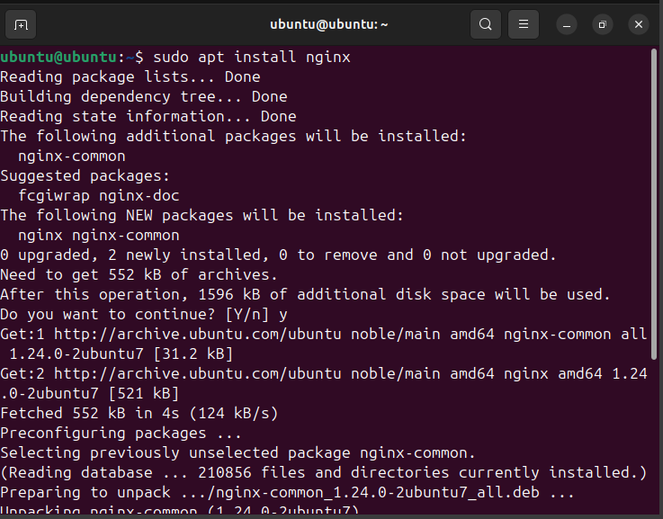

И о чудо, при вводе в строку браузера `localhost` у нас выводится приветственная страница nginx:
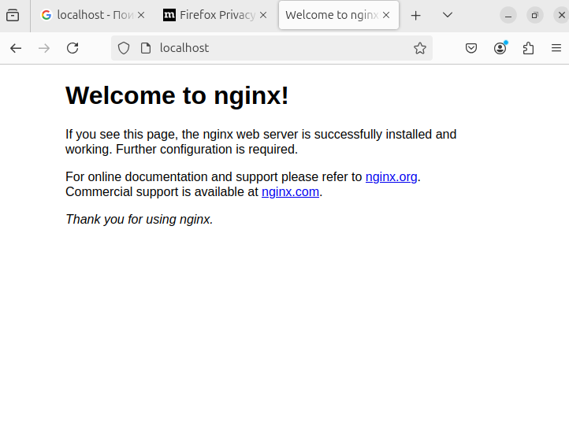

Значит это, что у нас есть собственный веб-сервер, но он пустой. Ура ура почти вся лаба готова! ~~ага конечно~~

## Создание проектов
В рамках данной лабораторной работы будем поднимать сервер с двумя сайтами. Для них создадим две папки
```bash
sudo mkdir -p /var/www/project1
sudo mkdir -p /var/www/project2
```

В этих папках создадим два сайта с простым содержанием
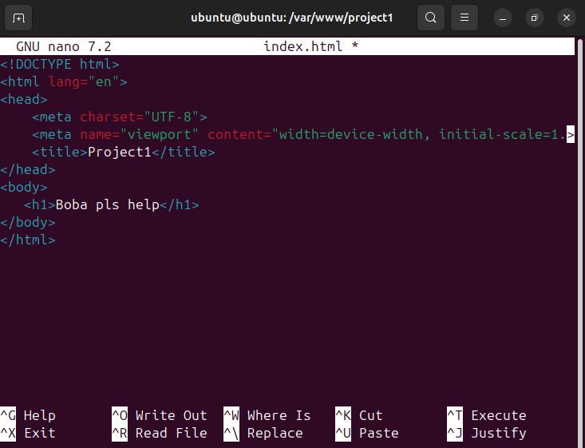

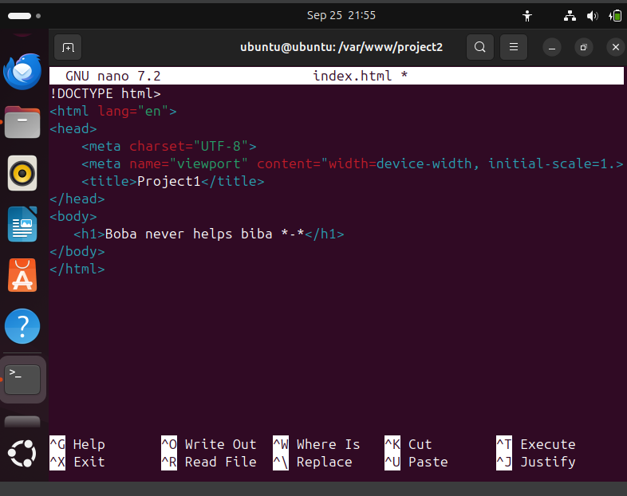

Прекрасно, файлики нужные есть. Теперь необходимо прописать этим файликами домены, чтобы можно было их тестировать локально.

Для этого заходим в консоль и прописываем команду
```bash
sudo nano /etc/hosts
```
И мы попадаем в встроенный редактор кода nano, в котором нужно установить нужные локальные домены. Установим `project1.aoao` и `project2.aoao`.

Чтобы сохранить, жмем `Ctrl + O`, сохраняем файл и выходим из nano, нажав `Ctrl + X`


Теперь домены у проектов есть, но файлы конфигурации не настроены. Надо исправлять.

## Настройка файлов конфигурации
Но прежде всего подумаем о перенаправлении с порта 80 на порт 443(безопасное подключение).

### Создание самоподписанных ssl сертификатов
Мы люди не гордые и делать все по умному(через специальные центры сертификации и тд) не будем, просто сгенерируем самоподписанный ssl сертификат.

Генерируем все это дело на 365 дней и сохраняем по указанным путям.

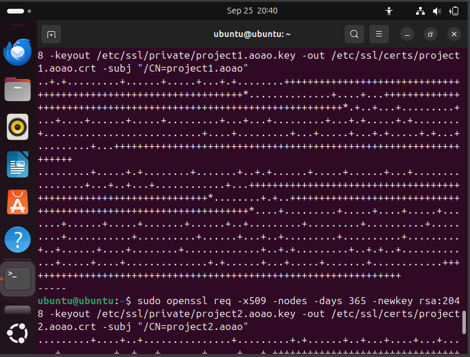

Сертификаты есть, переходим к настройке файлов конфигурации

### Собственно настройка файлов конфигурации

В файлах конфигурации у нас будет два блока `server{}`, где в одном у нас будет слушаться порт 80(http), а во втором блоке будет слушаться порт 443(https). В каждом блоке нужно имя сервера `server_name`, которое будет такое же, как и наши указанные локальные домены. Во втором блоке будут указываться наши самоподписанные сертификаты  `sssl_sertificate` и ключи `ssl_sertificate_key`. Для первого проекта выглядит файлик так, для второго создадим аналогичный.

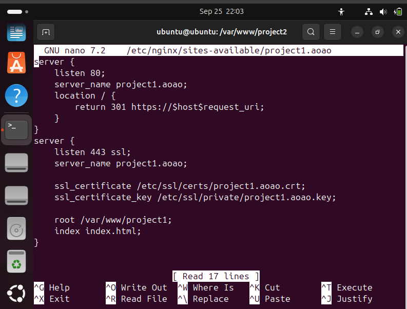

На данном этапе файлы конфигурации готовы, активируем их командами 

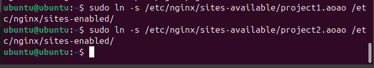

Далее проверяем командой, что все хорошо и перезапускаем nginx

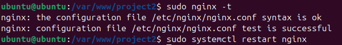

### Проверяем работу сайтиков

Введем в адресную строку браузера домен нашего первого сайта с http

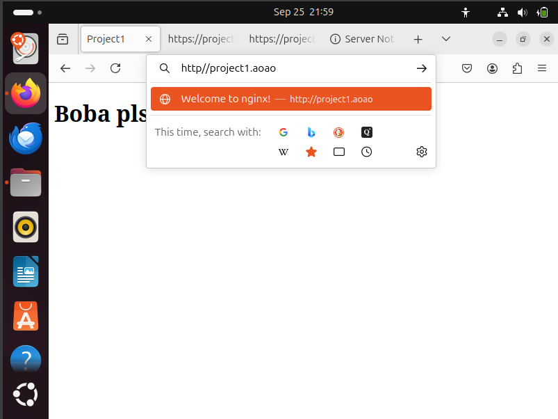

И видим, что все работает и происходит перенаправление на https!

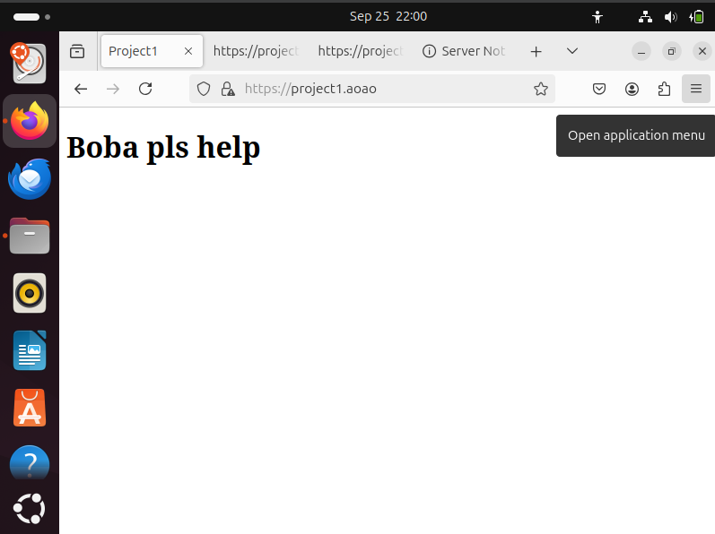

Второй сайтик также работает

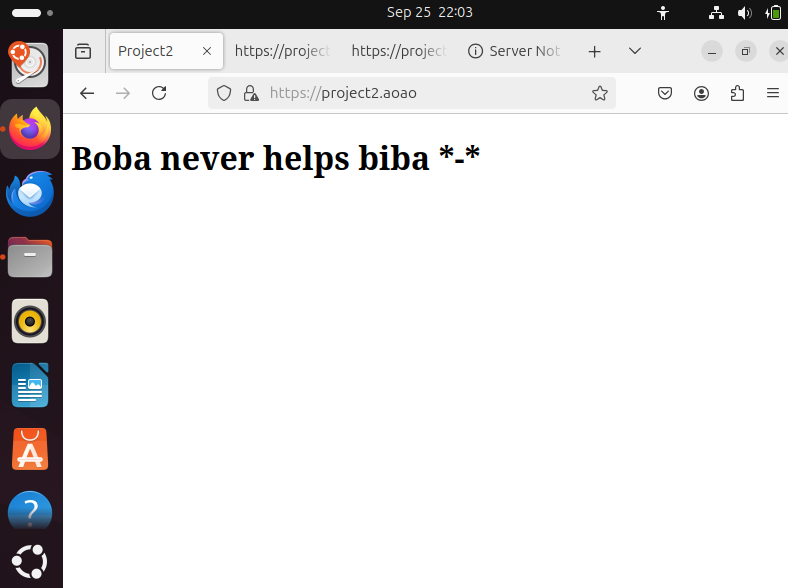

Урааа все запустилось работа проделана не зря!! Но это еще не все(

### Alias

Нам осталось настроить альясы для создания псевдонимов путей к файлам и каталогам на сервере.

Создадим в папке с первым проектом несколько вложенных друг в друга папок, где в последней будет лежать другой html файлик.


Напишем Dockerfile, который использует образ Ubuntu и устанавливает некоторые базовые пакеты. Ничего сложного, но для демонстрации плохих практик написания Dockerfile вполне сойдет.

## Плохие практики в Dockerfile
Итак, после написания у нас получилась такая картина:


Тут выделить можно три плохие практики:

1. **Использование тэга latest**: Этот тэг указывает на последнюю доступную версию образа, но проблема в том, что при каждой новой сборке может поменяться результат выполнения, если базовый образ обновится. Также если базовый образ обновится, то это может привести к проблемам с совместимостью

2. **Неочистка кэша**: После установки всех необходимых пакетов не очищаю кэш. Одно из негласных правил Docker - чем меньше контейнер, тем лучше. После завершения установки пакетов кэш оказывается не нужен, его очистка поможет сэкономить место и сделать контейнер легче
   
3. **Копирование всего каталога проекта**: У нас идет копирование всего каталога проета через (.). Это очень плохая практика, ведь мы можем скопировать абсолютно ненужные файлы, увеличив без надобности конечный вес контейнера. Кроме того, подобный подход может привести к потенциальным проблемам с безопасностью. В общем, бе (по аналогии с git add . в гите)

## Исправления плохих практик
Хорошо поразмыслив над ошибками и почесав репу, мы создаем новый, улучшенный и совершенный Dockerfile:


Вот что мы поменяли здесь:
1. **Используем конкретную версию базового образа**: Теперь у нас не может в теории возникнуть проблем с совместимостью или безопасностью - прошлая сборка гарантированно будет работать, как и новая

2. **Очищаем кэш**: Мы молодцы и выносим за собой мусор. Контейнер не будет весить больше, чем возможно - мы провели оптимизацию

3. **Копируем только те файлы, которые нужны**: конкретно в моем кейсе копируем все, кроме файла .gitignore. Этот файл был бы бесполезен для образа и мог дополнительно его нагружать. В общем случае мы оградили себя от ненужных файлов в контейнере, мешающих работе

## Плохие практики при работе с контейнерами

Иногда даже отличное написание Dockerfile не спасает от косяков при работе с контейнерами. Далее будут описаны две плохих практики:

1. **Неправильное понимание контейнеров как виртуальных машин**: Некоторые разработчики ошибочно воспринимают контейнеры как виртуальные машины и запускают свои приложения в уже созданных контейнерах, не разбивая их на отдельные компоненты. Но вот незадача, оказывается, в таком случае он или его команда не могут во время разработки и тестирования приложения воспользоваться преимуществами контейнеризации, такими как модульность и независимость компонентов. Поскольку контейнеры должны быть неизменяемыми, каждое изменение должно принимать форму создания нового образа. Если бы приложение не было разбито на части, это сделало бы обновление или повторное развертывание новых версий весьма проблематичным.

2. **Запуск нескольких контейнеров, использующих один и тот же порт на хосте**: При запуске нескольких контейнеров разработчики могут не обращать должного внимания на порт, хотя он тоже важен. Запуск нескольких контейнеров на одном порте может привести к непредсказуемому поведению: контейнеры могут как перекрываться друг другом, так и попросту приводить к ошибкам в приложении. Операционная система не сможет даже определить, какому контейнеру перенаправить входящие соединения. Поэтому необходимо всегда каждый контейнер настраивать на использование уникального порта на хосте

## Выводы

Любите докер и контейнеры и они будут любить вас! Чем проще и оптимальнее будете писать докерфайл, тем легче будет контейнер и тем больше пользы вы будете получать от процесса. Использование хороших практик и недопущение плохих вам в этом поможет.

