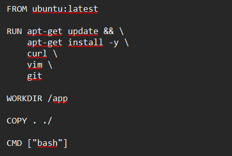
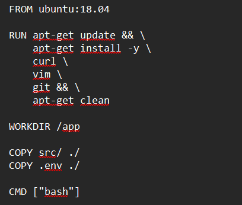

# Вторая лабораторная работа

Перед началом работы над лабораторной работой необходимо установить Docker. Это сделать можно несколькими способами, я же установил десктопную версию через сайт, чтобы было удобнее наблюдать за созданными образами и управлять контейнерами.
[Установить докер можно здесь](https://www.docker.com/products/docker-desktop/)

## Что мы будем писать?

Напишем Dockerfile, который использует образ Ubuntu и устанавливает некоторые базовые пакеты. Ничего сложного, но для демонстрации плохих практик написания Dockerfile вполне сойдет.

## Плохие практики в Dockerfile
Итак, после написания у нас получилась такая картина:

Тут выделить можно три плохие практики:

1. **Использование тэга latest**: Этот тэг указывает на последнюю доступную версию образа, но проблема в том, что при каждой новой сборке может поменяться результат выполнения, если базовый образ обновится. Также если базовый образ обновится, то это может привести к проблемам с совместимостью

2. **Неочистка кэша**: После установки всех необходимых пакетов не очищаю кэш. Одно из негласных правил Docker - чем меньше контейнер, тем лучше. После завершения установки пакетов кэш оказывается не нужен, его очистка поможет сэкономить место и сделать контейнер легче
   
3. **Копирование всего каталога проекта**: У нас идет копирование всего каталога проета через (.). Это очень плохая практика, ведь мы можем скопировать абсолютно ненужные файлы, увеличив без надобности конечный вес контейнера. Кроме того, подобный подход может привести к потенциальным проблемам с безопасностью. В общем, бе (по аналогии с git add . в гите)

## Исправления плохих практик
Хорошо поразмыслив над ошибками и почесав репу, мы создаем новый, улучшенный и совершенный Dockerfile:

Вот что мы поменяли здесь:
1. **Используем конкретную версию базового образа**: Теперь у нас не может в теории возникнуть проблем с совместимостью или безопасностью - прошлая сборка гарантированно будет работать, как и новая

2. **Очищаем кэш**: Мы молодцы и выносим за собой мусор. Контейнер не будет весить больше, чем возможно - мы провели оптимизацию

3. **Копируем только те файлы, которые нужны**: конкретно в моем кейсе копируем все, кроме файла .gitignore. Этот файл был бы бесполезен для образа и мог дополнительно его нагружать. В общем случае мы оградили себя от ненужных файлов в контейнере, мешающих работе

## Плохие практики при работе с контейнерами

Иногда даже отличное написание Dockerfile не спасает от косяков при работе с контейнерами. Далее будут описаны две плохих практики:

1. **Неправильное понимание контейнеров как виртуальных машин**: Некоторые разработчики ошибочно воспринимают контейнеры как виртуальные машины и запускают свои приложения в уже созданных контейнерах, не разбивая их на отдельные компоненты. Но вот незадача, оказывается, в таком случае он или его команда не могут во время разработки и тестирования приложения воспользоваться преимуществами контейнеризации, такими как модульность и независимость компонентов. Поскольку контейнеры должны быть неизменяемыми, каждое изменение должно принимать форму создания нового образа. Если бы приложение не было разбито на части, это сделало бы обновление или повторное развертывание новых версий весьма проблематичным.

2. **Запуск нескольких контейнеров, использующих один и тот же порт на хосте**: При запуске нескольких контейнеров разработчики могут не обращать должного внимания на порт, хотя он тоже важен. Запуск нескольких контейнеров на одном порте может привести к непредсказуемому поведению: контейнеры могут как перекрываться друг другом, так и попросту приводить к ошибкам в приложении. Операционная система не сможет даже определить, какому контейнеру перенаправить входящие соединения. Поэтому необходимо всегда каждый контейнер настраивать на использование уникального порта на хосте
