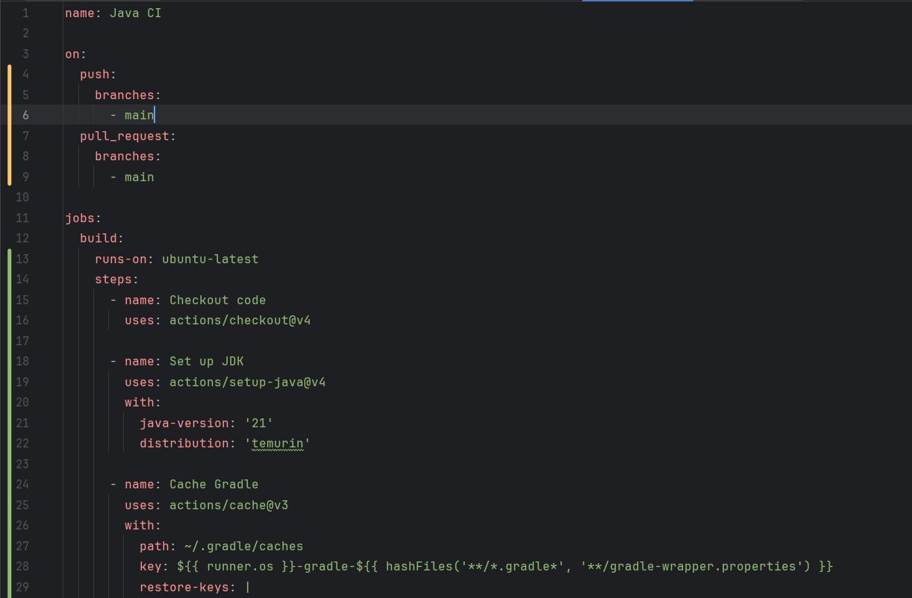
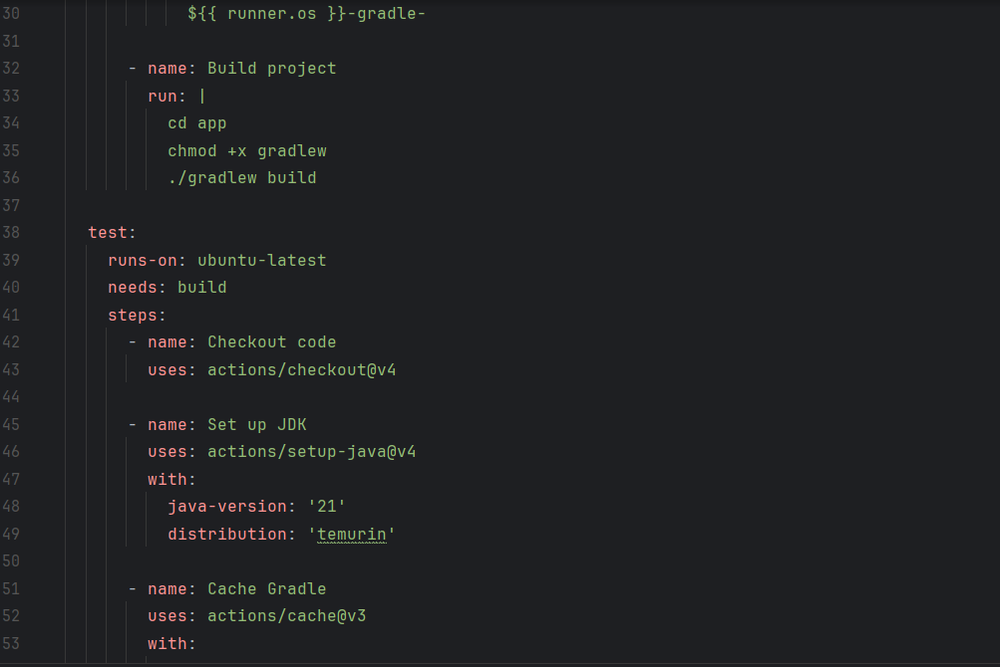
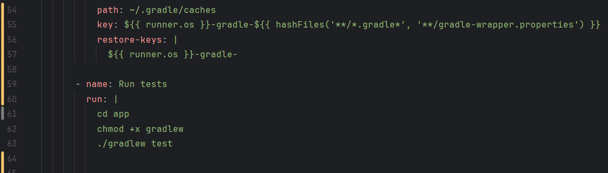

# Третья лабораторная работа

В данной лабораторной работе необходимо написать CI/CD, содержащий 5 bad practices и предложить варианты их исправления. Я не буду писать его специально для этой лабораторной, а возьму свой CI/CD файлик из проекта простенького java приложения(это все правда мое, на гитхабе лежит, не бейте) и посмотрю, сколько всякого у меня там есть и что можно исправить для более совершенной работы.

## Файл CI/CD

Напишем Dockerfile, который использует образ Ubuntu и устанавливает некоторые базовые пакеты. Ничего сложного, но для демонстрации плохих практик написания Dockerfile вполне сойдет.

## Плохие практики в Dockerfile
Итак, в проекте у меня был такой код. Вроде как делает, что ему нужно, но, покапавшись, несколько bad practices я выделил:

Тут выделить можно пять плохих практик:

1. **Отсутствие кэширования зависимостей**: Каждый раз при запуске пайплайна все зависимости заново прогружаются, что сильно утяжеляет и замедляет его работу

2. **Отсутствие именования процессов run**: Каждый run необходимо именовать для улучшения читаемости и упрощения отладки
   
3. **Отсутствует порядка выполнения тасков**: Если в процессе выполнения команд произойдет ошибка и выполнение пойдет дальше, то ни к чему хорошему это может не привести и будет риск поломки всей сборки проекта. Поэтому необходимо разделить порядок выполнения тасков так, чтобы запуск одной таски требовал запуска другой и, соответственно, одна не запускалась без другой
4. **В одной джобе два разные по смыслу таски**: Моя джоба называется build, но в ней я делаю и build, и тест. Логичнее их разделить между собой, чтобы можно были делегировать порядок их выполнения и для облегчения чтения.
5. **Нет указания веток на on событии**: Необходимо указывать конкретные события, при которых будет запускаться пайплайн, в том числе и ветки. Это даст нам контроль запуска и устранение ненужных сборок, кушающих ресурсы и время

## Исправления плохих практик
Ну штош, исправлять ошибки никогда не поздно!

Вот что мы поменяли здесь:
1. **Захэшировали зависимости**: Теперь у нас будут последующие пайплайны запускаться быстрее!

2. **Заименовали все процессы run**: Код теперь читаемее и проще отлаживается

3. **Разделил таски на две разные по смыслу джобы**: Теперь таски выполняются в разных джобах, что упрощает отладку и улучшает читаемость(да и вообще если так не делать, то плохо будет да)

4. **Объявил поряд выполнения джобов**: Теперь джоба test не может быть запущена без успешно выполненной build, что исключает возможность ошибок и поломок

5. **Указал в on ветку main**: Теперь при расширении проекта на много веток этот пайплайн, предназначавшийся изначально для одной ветки, будет запускаться только тут

## Выводы

CI/CD - Это круто! Я их использовал и до лабы, но, как оказалось, не очень качественно, что смог найти аж целых пять ошибок и недоработок своего кода и сделал проект симпатичнее и приятнее. 
